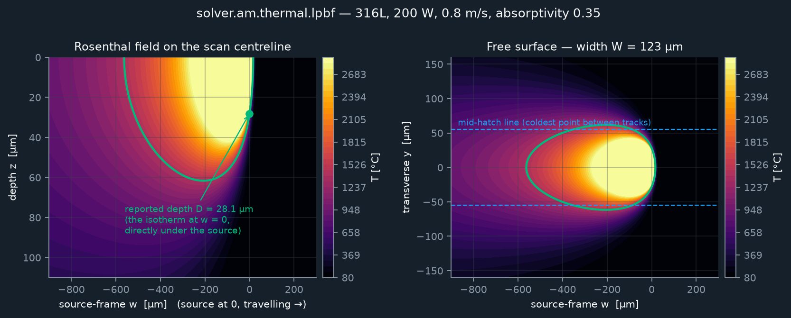
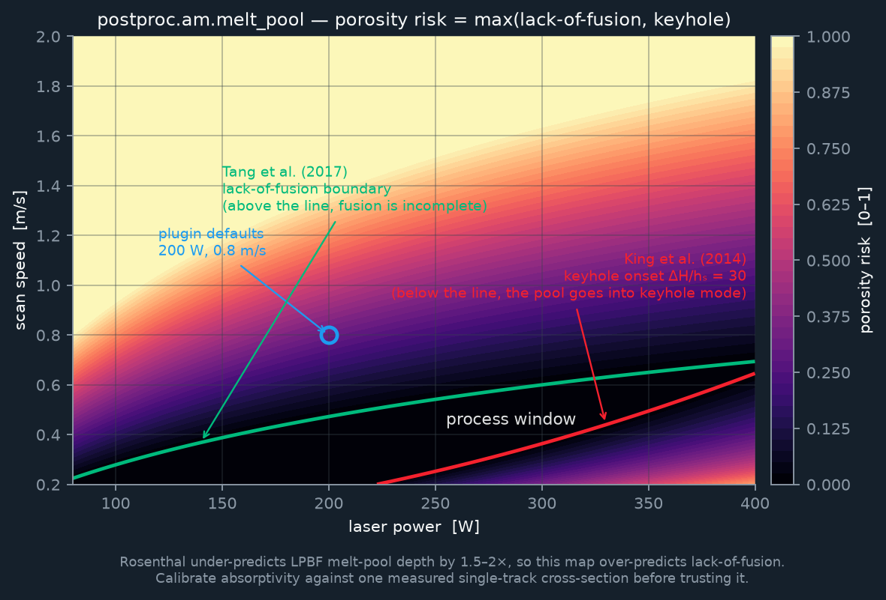
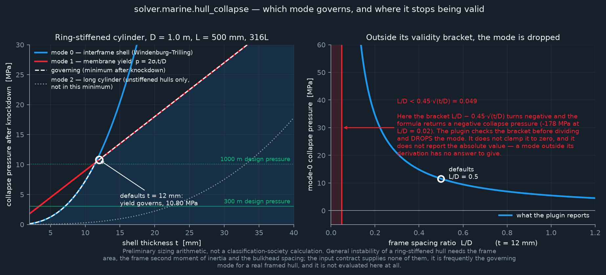
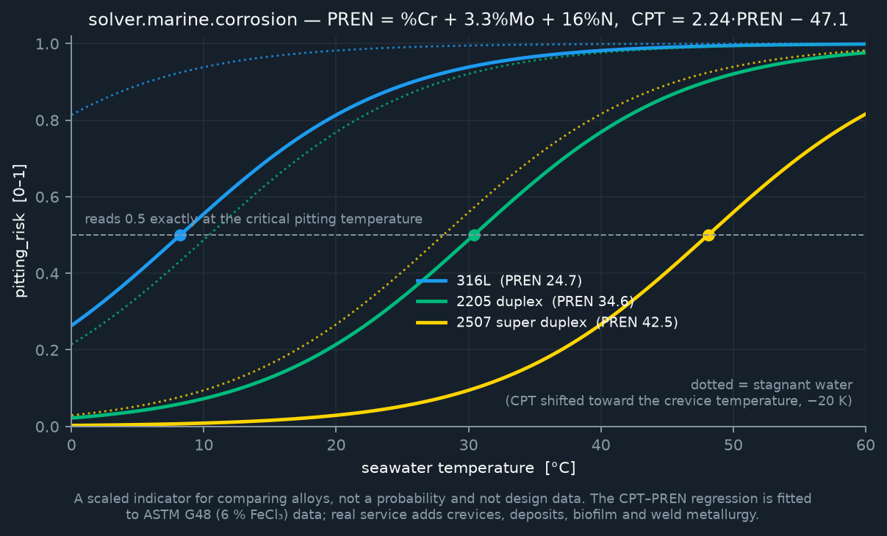

# The physics in souxmar

This page is for the engineer who has to decide whether to trust a number
that came out of this software. One section per model: the governing
equation, the source it comes from, the envelope it is valid in, and — the
part most tools leave out — **which direction it is wrong in, and by how
much.**

Read the headline first, because it applies to every model on this page:

> Every model documented **on this page** is **closed-form or heuristic**.
> None of them discretises anything. There is no stiffness matrix, no
> assembly, no linear solve, no time integration, and no mesh convergence to
> study — refining the mesh will not change a single number below. They are
> **screening and preliminary-sizing aids**: tools for ranking options,
> sanity-checking a supplier's claim, and finding the parameter you should go
> and measure. They are not calibrated process simulations, and nothing here
> is a qualification, an approval, or a permit to build, dive or fly.

That headline used to say "every model in this repository", and until
`solver.elasticity.fem` landed it was true of the whole default build. It is
now true only of this page.

Two capabilities do discretise:

- **`solver.elasticity.fem`** — small-strain linear isotropic elasticity by
  isoparametric FEM (Tet4 and Hex8), assembled to a CSR stiffness matrix and
  solved with Jacobi-preconditioned conjugate gradients. Always-on, no
  external dependency, and it passes the constant-strain patch test exactly
  on both elements. Its own validity envelope — shear locking in bending,
  volumetric locking as ν → 0.5, no stress output — is documented in the
  plugin header and in [`CAPABILITIES.md`](CAPABILITIES.md). It is not
  covered on this page because this page is about closed-form models; a
  discretised solver's error is a property of the mesh, not of a correlation.
- **`solver.heat.fenicsx`** — DOLFINx + PETSc Poisson, behind an opt-in build
  flag and therefore not built by any CI leg.

`solver.heat.linear`, `solver.elasticity.linear`, `solver.modal.linear` and
`solver.cfd.simple` remain **demonstration stubs** — see
[`CAPABILITIES.md`](CAPABILITIES.md) for what each one actually returns.

Every equation on this page is reproduced independently by
[`scripts/gen-physics-figures.py`](../scripts/gen-physics-figures.py), which
also draws the figures. Running it with `--verify` re-derives the ten
worked numbers written into the plugin headers:

```console
$ python3 scripts/gen-physics-figures.py --verify
  ok   am-thermal  cooling rate [K/s]                 1.877e+06  header says 1.9e+06
  ok   am-thermal  ΔH/hₛ @200 W 0.8 m/s                   13.48  header says 13.5
  ...
  10/10 header hand-checks reproduced.
```

---

## 1. LPBF thermal history and melt pool

`solver.am.thermal.lpbf` · `postproc.am.melt_pool` · [`examples/plugins/am-thermal/`](../examples/plugins/am-thermal/)



### Governing equation

The quasi-steady temperature field around a point source of absorbed power
`q = absorptivity · laser_power` travelling at speed `v` across the surface
of a semi-infinite solid:

```
T(w, y, z) = T₀ + q / (2π k R) · exp( −v (R + w) / (2α) )

  R = √(w² + y² + z²)     distance to the source        [m]
  w                       source-frame coordinate, > 0 ahead of the source
  α = k / (ρ c)           thermal diffusivity           [m²/s]
```

**Rosenthal, D.**, "The theory of moving sources of heat and its application
to metal treatments", *Trans. ASME* **68** (1946) 849–866.

The `2π` rather than `4π` is the **surface-source** form: a source sitting on
the free surface of a half-space spreads heat into a hemisphere, not a full
sphere. Using `4π` would halve every temperature rise.

### What is derived from it

| Quantity | How |
| --- | --- |
| Melt-pool depth `D` | The `T = T_melt` isotherm on the centreline directly under the source (`w = y = 0`). The left-hand side is strictly decreasing in `D`, so the root is bracketed by `(0, R_c]` with `R_c = q / (2π k ΔT_melt)` and found by **100 bisections**. |
| Melt-pool width `W` | The widest point of the same isotherm on the free surface. Parametrised by `R`: `w(R) = −R − (2α/v)·ln(R/R_c)`, `y(R)² = R² − w(R)²`, unimodal between the trailing and leading tips. Found by a **1024-point scan plus 100 ternary-search refinements**. |
| Cooling rate at solidification | Falls out in closed form at the trailing tip: `\|dT/dt\| = 2π k v ΔT_melt² / q`. At the 316L defaults this is **1.9 × 10⁶ K/s** — the right order for LPBF (10⁵–10⁷ K/s). |
| Keyhole onset | Normalised enthalpy `ΔH/hₛ = A·P / (hₛ √(π α v σ³))`, `hₛ = ρ c T_melt[K]`. **Hann, Iammi & Folkes**, *J. Phys. D* **44** (2011) 445401; **King et al.**, *J. Mater. Process. Technol.* **214** (2014) 2915–2925. |

**Those fixed iteration counts are deliberate, not laziness.** souxmar's
determinism gate requires byte-identical output on Linux, macOS and Windows.
A tolerance-based exit (`while (hi - lo > 1e-9)`) can take a different number
of iterations on different platforms once the last bit of a `libm` call
differs, and the answer then differs in the last bits too. A fixed count
always executes the same arithmetic in the same order. See the
[`auditing-determinism`](../.claude/skills/auditing-determinism/SKILL.md) skill.

### Read the left-hand figure carefully

The reported depth `D = 28.1 µm` is the isotherm **at `w = 0`, directly under
the source**. It is not the deepest point of the pool: the melt region
reaches roughly 62 µm about 200 µm behind the source, because the exponential
barely decays along the trailing centreline. If you are comparing against a
cross-sectioned single track, know which of the two your metallographer
measured.

### Validity envelope

| Holds | Fails |
| --- | --- |
| Conduction-mode LPBF, quasi-steady, single track | Keyhole mode (scored by ΔH/hₛ, never modelled) |
| Semi-infinite solid, uniform isotropic properties | Thin walls, overhangs, near a free edge |
| Temperature-independent `k`, `ρ`, `c` | Anything near the melting range where they are not |
| One scan vector at a time | Stripe / island / rotating scan strategies, contour-vs-infill, vector-end overheating |

Not present at all: latent heat of fusion, Marangoni convection, surface
depression, radiation and convection losses, powder-vs-solid conductivity
contrast, discrete powder particles, denudation, spatter, balling, oxide
films, recoil pressure. Peak temperature is capped at 2900 °C because
Rosenthal's point source is singular at `R = 0`.

### Known error — direction and magnitude

> **Rosenthal systematically under-predicts LPBF melt-pool depth in
> conduction mode, typically by 1.5–2×.**

It neglects latent heat, Marangoni convection, surface depression and the
higher effective absorptivity of a powder bed. The consequence propagates:
because `D` is under-predicted, the lack-of-fusion index is
**over**-predicted, so the tool is **conservative on porosity** — it will
tell you a recipe is marginal when it is fine, rather than the reverse.

**Before you trust a number from this model, calibrate `absorptivity`
against one measured single-track cross-section.** The default 0.35 is a
flat-plate 316L value at 1070 nm; powder beds with multiple scattering, or
in keyhole mode, absorb 0.5–0.7.

---

## 2. Porosity risk

`postproc.am.melt_pool` · [`examples/plugins/am-thermal/`](../examples/plugins/am-thermal/)



Two competing mechanisms sit at opposite ends of the process window, so the
reported risk is the **larger** of the two, not their sum.

**Lack of fusion.** With hatch spacing `h`, powder layer thickness `t`, and
`W`, `D` from §1, material is fully fused when

```
I_lof = (h/W)² + (t/D)²  ≤  1
```

**Tang, Pistorius & Beuth**, "Prediction of lack-of-fusion porosity for
powder bed fusion", *Additive Manufacturing* **14** (2017) 39–48. The
sub-score is `clamp01((I_lof − 1) / 3)` — **exactly zero** while the
published criterion says fully fused, then rising, saturating at `I_lof = 4`.
That upper anchor is an interpolation choice, not a measured threshold.

**Keyholing.** `clamp01((ΔH/hₛ − 30) / 30)`. The 30 is King et al.'s
*measured* conduction-to-keyhole transition. The 60 is an interpolation
anchor for the fully developed keyhole regime, **not** a measured threshold.

At the plugin defaults `I_lof = 1.93 → 0.31`: the default 200 W / 0.8 m/s /
110 µm / 30 µm recipe sits just past the Tang boundary *for this model*,
which is exactly the 1.5–2× depth under-prediction of §1 showing up
downstream. Calibrate first, then read the map.

---

## 3. Residual distortion and residual stress

`solver.am.distortion.inherent_strain` · `postproc.am.residual_stress` · [`examples/plugins/am-distortion/`](../examples/plugins/am-distortion/)

### Governing equations

The **inherent-strain (eigenstrain)** method lumps the whole thermo-mechanical
history of one deposited layer into a single stress-free strain, applied
mechanically layer by layer on the growing part.

**Keller, N. & Ploshikhin, V.**, "New Method for Fast Predictions of Residual
Stress and Distortion of AM Parts", *Proc. 25th Solid Freeform Fabrication
Symposium* (2014) 1229–1237.

**1 — Inherent strain**, equibiaxial in the plane normal to the build axis:

```
ε* = −CTE · (T_melt − T_preheat) · strain_calibration
```

Negative: material that solidifies from the melt wants to shrink. At the
316L defaults (CTE 1.6 × 10⁻⁵ /K, 1400 °C, 80 °C, calibration 0.30)
`ε* = −6.34 × 10⁻³`, inside the 10⁻³–10⁻² band reported for LPBF steels.

**2 — Curvature, accumulated per layer.** Each new layer of thickness `h` is
a shrinking film bonded to thickness `t_below`. For two layers of the *same*
alloy, force and moment balance give the exact curvature increment:

```
Δκ = 6 · (−ε*) · h · t_below / (h + t_below)³        [1/m]
```

**Timoshenko, S.**, "Analysis of Bi-Metal Thermostats", *J. Opt. Soc. Am.*
**11** (1925) 233 (equal-modulus limit). For `h ≪ t_below` this reduces
exactly to **Stoney**'s thin-film relation, *Proc. R. Soc. Lond. A* **82**
(1909) 172–175. Because the biaxial modulus `M = E/(1−ν)` appears in both
film and substrate it **cancels** — `E` and `ν` do not scale this curvature.

Summing increments against the *current* composite, rather than applying one
lumped eigenstrain to the finished section, follows **Townsend, Barnett &
Brunner**, *J. Appl. Phys.* **62** (1987) 4438. It deliberately predicts a
larger bow (0.88 vs 0.24 1/m on the 20-layer demo): a deposited layer
stiffens the part only against *later* layers, and that asymmetry is the
physical reason layer-lumped models under-predict distortion.

Positive `κ` means the free edges rise — the classic result that a plate
built on a baseplate springs into a "smile" the moment it is cut free,
because the deposit on top is the side in tension.

### The number that decides everything

`strain_calibration` is the fraction of free thermal contraction that
survives as permanent plastic strain instead of relaxing away.

> **It must be calibrated against a measured part, per machine and per
> material.** 0.30 is a plausible starting value for 316L on an LPBF
> machine and nothing more.

It must also be **re-calibrated whenever `layer_height` changes**, because
the model accumulates one curvature increment per simulation layer: halving
the layer height roughly doubles the predicted bow. Supply `inherent_strain`
directly to bypass the derivation — that is the form a calibration campaign
reports its result in.

### Validity envelope and known error

Distortion grows monotonically with layer count and falls as the substrate
thickens (measured ≈ `1/t_s^1.8` over `t_s` = 10 → 40 mm with a 2 mm
deposit, approaching `1/t_s²` as the deposit thins). Worked demo — a
60 × 20 × 20 mm box, 20 layers of 1 mm, free branch: `κ = 0.882 1/m`, far
corner rises 490 µm and moves 379 µm inward.

Tens of microns to a millimetre is the range measured on real LPBF coupons,
and that order-of-magnitude agreement is the **only** claim being made. A
20 mm thick block would in practice bow considerably less than the demo
figure — which is precisely what `strain_calibration` exists to absorb.

Not present: any FE solve, stiffness matrix, plasticity model, phase
transformation, support-structure stiffness, or scan-strategy dependence.

---

## 4. Polymer AM interlayer bonding

`solver.am.polymer.fff` · `postproc.am.bond_strength` · [`examples/plugins/am-polymer/`](../examples/plugins/am-polymer/)

In fused-filament fabrication the part is a stack of welded roads, and
Z-direction strength is set by the **thermal history at the road interface**,
not by the bulk polymer. Lumped-capacitance (Newtonian) cooling, evaluated
once per layer:

```
L_c  = h·w / (w + 2h)            characteristic length of one road   [m]
τ    = ρ c L_c / h_conv          lumped time constant                [s]
z_bed = √(α τ) = √(k L_c / h_conv)      bed influence decay length   [m]

T_env(j)    = T_chamber + (T_bed − T_chamber) · exp(−z_j / z_bed)
T_iface(j)  = ½ (T_nozzle + T_sub(j−1))
T_sub(j)    = T_env(j) + (T_iface(j) − T_env(j)) · exp(−t_layer / τ)
```

**Incropera & DeWitt**, *Fundamentals of Heat and Mass Transfer*
(lumped-capacitance method). The convecting area is `w + 2h`, not the full
perimeter: the bottom face is welded to the layer below, not exposed. The
interface starts at the arithmetic mean of the two temperatures because for
polymer-on-polymer the contacting-semi-infinite-bodies result reduces to the
mean when `ρck` matches on both sides.

### Validity envelope — check the Biot number

The lumped assumption requires `Bi = h_conv·L_c/k ≪ 0.1`.

| Configuration | `Bi` | Verdict |
| --- | --- | --- |
| Defaults (PEKK-like, 0.2 × 0.4 mm road) | **0.012** | Comfortably admissible |
| Large-format bead, `w = h = 10 mm` | **0.4** | **Four times past the limit** — the real bead has a through-thickness gradient this model cannot see |

**The plugin does not enforce the Biot criterion.** It is stated in the
header and stated here; checking it is yours.

At the defaults `z_bed = 0.91 mm`, so the bed dominates over the first ~5
layers and the chamber owns everything above ~3 mm. Note what is deliberately
**absent** from `z_bed`: `layer_time`. Scaling the bed's reach with the layer
interval would make a slower build look better bonded low down, fighting the
correct cooling penalty and leaving the model non-monotone in `layer_time`.
The fin length is the steady answer and carries no time.

---

## 5. Design-for-AM checks

`solver.am.overhang` · `solver.am.printability` · `solver.am.buildtime` · [`examples/plugins/am-manufacturability/`](../examples/plugins/am-manufacturability/)

**Overhang** is geometry, and exact. For every boundary facet with outward
unit normal `n` and unit build direction `b`, the facet is downward when
`n·b < 0`, and its tilt from the build plate is `acos(|n·b|)`. Support is
needed when any downward facet tilts below the threshold. Verified:
`n = (0,0,−1)` → 0.000°, `n = (1,0,0)` → 90.000°, `n = (1,0,−1)/√2` →
45.000°.

The 45° default is the powder-bed rule of thumb (**Thomas**, "The development
of design rules for selective laser melting", 2009; reproduced in every
vendor DfAM guide). It is a **rule of thumb, not a material property** — real
self-supporting angles run roughly 30–50° depending on alloy, layer height
and beam parameters.

**Printability is a weighted-penalty heuristic**, and the weights are a
documented choice rather than a measurement:

```
printability = clamp01( 1 − (0.40·p_overhang + 0.30·p_thin
                             + 0.15·p_aspect + 0.15·p_corr) )
```

with a hard gate at zero if the bounding box does not fit the build volume.
The 8:1 slenderness anchor behind `p_aspect` recurs in vendor DfAM guides for
recoater collision and part toppling; it is **not a validated limit**. The
wall-thickness proxy is `2·V_cell / A_boundary(cell)`, which evaluates to
exactly `t` for a wall meshed with one cell through its thickness — and
carries no information at all on a surface mesh, where the thin-wall
penalties are skipped.

Treat the score as a **ranking device between orientations of the same part**,
not as an absolute measure of whether a part will print.

---

## 6. Hydrostatic loading

`solver.marine.hydrostatic` · [`examples/plugins/marine/`](../examples/plugins/marine/)

```
p(i, j) = ρ g (depth_top(j) + (z_top − z_i))   [+ p_atm]
```

`ρ` is either given explicitly or evaluated from the **one-atmosphere
International Equation of State of Seawater** (**Millero & Poisson 1981** /
UNESCO Technical Paper 44, 1983), valid 0–42 PSU and −2 to 40 °C with a fit
error of 3.6 × 10⁻³ kg/m³. `ρ(35 PSU, 10 °C) = 1026.95 kg/m³`, so the default
300 m design depth gives 3.021 MPa gauge at the top of the hull.

The three default depth factors are the three cases a subsea pressure
boundary is checked at, and they land in the field as three time steps:
**1.00** operating, **1.50** test/proof, **2.25** collapse/crush.

### Known error — direction and magnitude

> The equation of state is the **one-atmosphere** form. Real in-situ seawater
> is compressed by the column above it, raising density by roughly **0.5 % per
> 1000 m**. The resulting pressure error is under 0.2 % at 300 m and about
> **1.5 % at 3000 m, in the unconservative direction.**

This is pressure only — no stress, no strain, no deflection. It also loads
**every** node, wetted or not; internal and dry surfaces are the consumer's
problem. A structural stage must apply the field as a follower load along the
inward surface normal, because this solver does not know which faces are wet.

---

## 7. Pressure-hull collapse

`solver.marine.hull_collapse` · [`examples/plugins/marine/`](../examples/plugins/marine/)



Four closed forms; the governing pressure is the **minimum over the applicable
modes after knockdown**, ties resolved to the lowest mode code.

| Mode | Formula | Source |
| --- | --- | --- |
| 0 — interframe shell instability | `p = 2.42 E (t/D)^2.5 / [ (1−ν²)^0.75 (L/D − 0.45√(t/D)) ]` | **Windenburg & Trilling (1934)**, the closed-form approximation to von Mises; in the form given in **Ross**, *Pressure Vessels: External Pressure Technology*, 2nd ed. §3, and **Moss**, *Pressure Vessel Design Manual*, 4th ed. |
| 1 — membrane yield | `p = 2 σ_y t / D` (cylinder) · `p = 4 σ_y t / D` (sphere) | Thin-wall hoop / sphere membrane stress |
| 2 — long-cylinder instability | `p = 2 E t³ / [ (1−ν²) D³ ]` | Classical ring / Bresse–Levy with plane-strain correction. **Cylinders only** — it is the collapse of a hull whose frames contribute nothing. |
| 3 — sphere elastic buckling | `p = 2 E (t/R)² / √(3(1−ν²))` | **Zoelly (1915)** |

### One deliberate, documented deviation from the contract

The capability contract quotes a single membrane-yield formula,
`p = 2σ_y t/D` — the **cylinder** hoop form. A sphere's membrane stress is
`pD/4t`, so this plugin uses `p = 4σ_y t/D` for `hull_type: sphere`. Applying
the cylinder form to a sphere would halve the reported yield pressure:
conservative, but wrong, and wrong in a way a naval architect would read as a
bug.

### Dropped, not clamped

Mode 0 is valid only for thin shells with `L/D > 0.45√(t/D)`. The bracket is
checked **before** the division, and outside it the mode is **dropped from the
minimum entirely** — not clamped to zero, not reported as its absolute value.
At `t = 12 mm`, `D = 1 m`, the formula evaluated at `L/D = 0.02` returns
**−178 MPa**. A mode outside its derivation has no answer to give, and saying
so is more useful than returning a number. The right-hand panel of the figure
above is that boundary.

### Knockdowns, and where they are not enough

Elastic modes (0, 2, 3) are multiplied by `imperfection_knockdown ×
am_anisotropy_knockdown`; the yield mode by anisotropy alone, because
out-of-roundness knocks down buckling, not yield strength.

> `imperfection_knockdown` defaults to **0.75**, reasonable for a
> well-controlled cylinder. **For a sphere it is badly optimistic**: measured
> hemisphere collapse commonly falls at **0.2–0.5 of classical** (**von Kármán
> & Tsien 1939**; **Krenzke & Kiernan 1963**). Lower it yourself — the plugin
> will not do it for you.

> `am_anisotropy_knockdown` defaults to **0.90**. Reported LPBF 316L property
> anisotropy between in-plane and build-direction loading is typically
> **5–15 %**; 0.90 sits mid-band and must be replaced by your own
> witness-coupon data.

### What is not evaluated at all

> **General instability of a ring-stiffened cylinder is not computed.** It
> needs the ring frame area, the frame second moment of inertia and the
> bulkhead spacing (**Bryant 1954** / **Kendrick**), and this capability's
> input contract supplies none of them. **It is frequently the governing mode
> for a real framed hull and MUST be checked separately.**

Also absent: frame yielding, frame tripping, shell–frame interaction,
end-closure and penetration effects, weld and build residual stress, creep.

**This is not a classification-society calculation.** A pressure hull is
approved against a class rule — DNV-RU-SHIP Pt.5 Ch.7 for submersibles, ABS
*Underwater Vehicles*, or a naval standard — using the surveyor's own
formulae, tolerances, weld and out-of-roundness measurements. Nothing here
substitutes for that, and nothing here is a permit to dive.

---

## 8. Seawater corrosion

`solver.marine.corrosion` · [`examples/plugins/marine/`](../examples/plugins/marine/)



Three per-cell indicators for a part in seawater for `service_life_years`.

### Wall penetration

The number you compare against your corrosion allowance, summed over three
terms.

**Uniform:** `rate_ref(alloy) · f_T · f_O₂ · f_S · f_v · f_surface · years`

| Factor | Form | Source |
| --- | --- | --- |
| `f_T` | `2^((T − 10 °C)/15 K)`, clamped [0.5, 8] | "Rate doubles every 10–15 K" for aqueous corrosion — **ASM Handbook Vol. 13A** |
| `f_O₂` | `O₂ / 8 mg/L`, clamped [0.05, 2.5] | Oxygen reduction is the cathodic rate-determining step in aerated seawater — **LaQue (1975)** |
| `f_S` | `√(S / 35 PSU)`, clamped | A deliberately weak conductivity/chloride term |
| `f_v` | `(v / 0.5 m/s)^0.35`, clamped [0.5, 2.5]; above the alloy's critical velocity an erosion-corrosion multiplier `1 + 1.5(v/v_crit − 1)` capped at 6 | **Efird**, *Corrosion* **33**(1) (1977). Copper alloys are the only entries with a real critical velocity. |
| `f_surface` | 1.3 when as-built, else 1.0 | Engineering judgement — see the caveat below |

**Galvanic:** the couple is assumed **oxygen-limited**, the normal case in
aerated seawater — the cathode consumes electrons only as fast as oxygen
arrives:

```
i_anode = i_lim · f_O₂ · f_v · area_ratio · min(drive, 1)
rate    = i_anode · k_ec(alloy)
```

`i_lim = 0.15 A/m²` is the initial design current density for temperate open
seawater in **DNV-RP-B401**; `k_ec` is the Faraday thickness-loss coefficient
(1.16 mm/a per A/m² for iron). `drive = |ΔE| / 0.25 V`, capped at 1, because
past that the couple is already oxygen-limited; 0.25 V is the unlike-metal
coupling limit of **MIL-STD-889C** for general marine service. Only the
**anodic** member loses metal.

**Pitting:** `depth = k_pit √(years)`, weighted by `pitting_risk²`. The
square-root-of-time form is standard in the marine immersion literature
(**Melchers**, *Corrosion* **59–60**, 2003–2004). The `risk²` weight is an
explicit tuning choice with **no derivation** — it suppresses the term when
initiation is unlikely.

> This is rate × life with **no wall-thickness limit**, because wall thickness
> is not an input. A result larger than your wall means the part perforates
> somewhere inside the service life. It does **not** mean that much metal was
> available to lose. A small anode wired to a large cathode (area ratio 10 or
> 100) produces exactly such a number — that is the model telling you the
> couple is unacceptable.

### Pitting risk (0–1) — an indicator, not a probability

```
PREN = %Cr + 3.3·%Mo + 16·%N
CPT  = 2.24·PREN − 47.1     [°C]
```

The CPT-vs-PREN regression on **ASTM G48** (6 % FeCl₃) data used throughout
the duplex literature (**Bernhardsson** / **Rondelli**). The indicator is a
logistic in `(T − CPT)` with an 8 K width, so it reads **exactly 0.5 at the
critical pitting temperature**. Stagnant water lowers the critical
temperature toward the **crevice** temperature — deposits and biofilm make
crevices — by up to 20 K, faded in linearly below 0.3 m/s.

Titanium is treated as immune below the ~80 °C seawater limit. Copper alloys
and aluminium get a flat base risk because **PREN does not order them at
all** — the formula is meaningful only for stainless and Ni-Cr-Mo alloys.

### Known errors and honest gaps

> **The as-built-surface penalty is engineering judgement, and the literature
> is genuinely split.** Fully dense LPBF 316L often *out-performs* wrought
> 316L, thanks to its fine cellular structure and absence of MnS inclusions.
> The 1.3 factor is a conservative default, not a measured value.

Not modelled: microbiologically-influenced corrosion, sulfide-polluted
seawater, chlorination, crevice geometry, weld metallurgy, sensitisation,
stress-corrosion cracking, hydrogen embrittlement of the cathodic member
(which matters when titanium or a high-strength steel is the noble half), and
any fatigue interaction.

The galvanic term is a **bounding** estimate: it assumes the couple stays
polarised for the whole life and ignores anode consumption, current
distribution and electrolyte path resistivity. A part nowhere near its mating
metal is not galvanically coupled at all.

**Every rate here is an indicative literature value chosen to let alloys be
compared.** A design corrosion allowance comes from a project corrosion
assessment, exposure data, and a DNV-RP-B401-style current-demand calculation.

### A determinism note

This is the only marine file with cross-`libm` exposure: three calls, `std::exp`
in the logistic and `std::pow` for the temperature and velocity factors.
Everything else is add/multiply/sqrt, which are correctly rounded IEEE-754
operations. `std::pow` and `std::exp` may differ in the last bit or two between
platform libms, and there is no bit-exact stdlib-only replacement.
`solver.marine.hydrostatic` and `solver.marine.hull_collapse` are written to
avoid them entirely.

---

## Reproducing everything on this page

```bash
pip install matplotlib numpy
python3 scripts/gen-physics-figures.py --verify   # re-derive the header numbers
python3 scripts/gen-physics-figures.py            # redraw every figure
```

The figures are committed under [`docs/img/`](img/). The script is an
**independent** implementation of the same closed forms — if it and the C++
plugin headers ever disagree, one of them is wrong and it is worth finding
out which.
